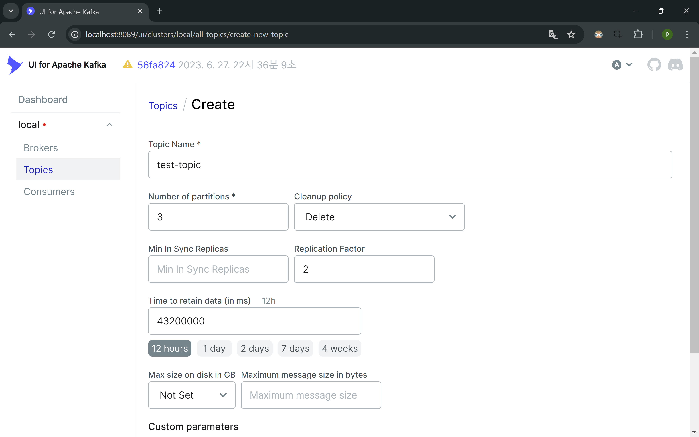
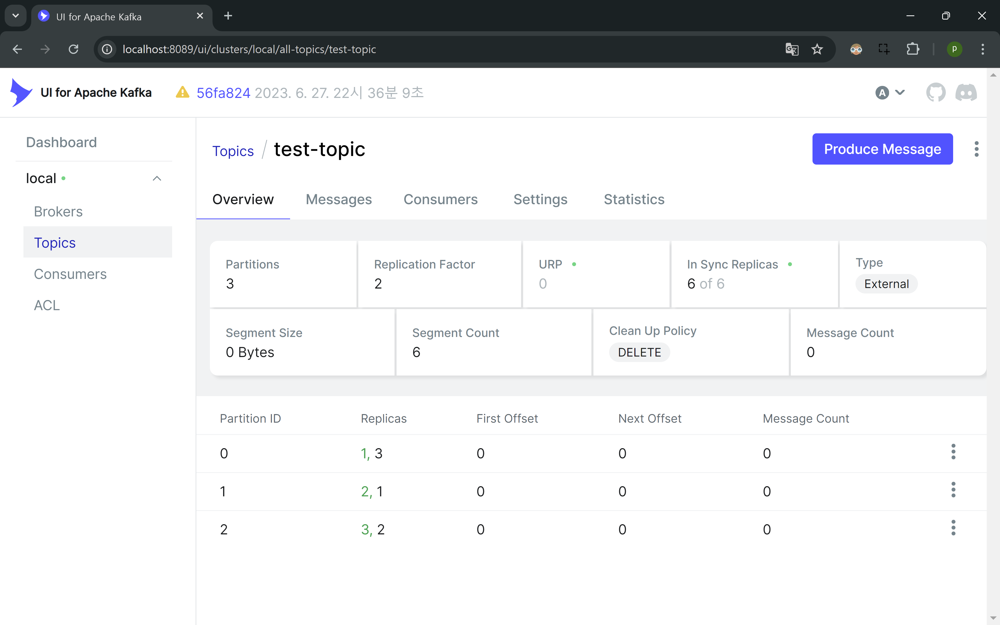

spring-cloud-stream을 이용한 kafka pub/sub 예제
===

1. docker compose up -d
2. [kafka-ui](http://localhost:8089)접속
3. topic 생성
   

- Number of partitions : 3
- Replication Factor : 2
- Time to retain data : 12 hours

- Leader / Follower 생성 확인

4. SpringCloudStreamApp 구동
5. [local swagger 접속](http://localhost:8080/docs)
6. POST /message API 호출
7. spring-cloud-stream 환경에서 kafka를 이용한 TestMessage Pus/Sub 확인
